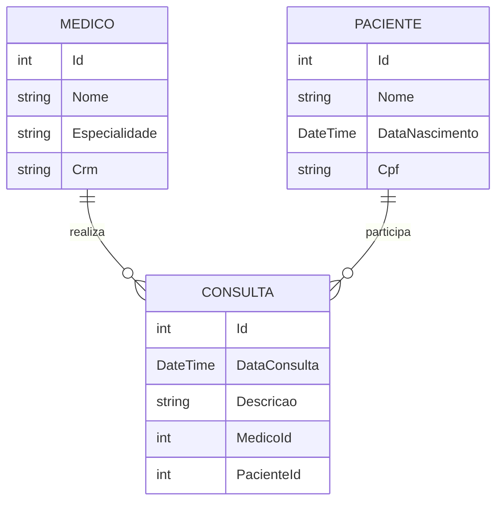
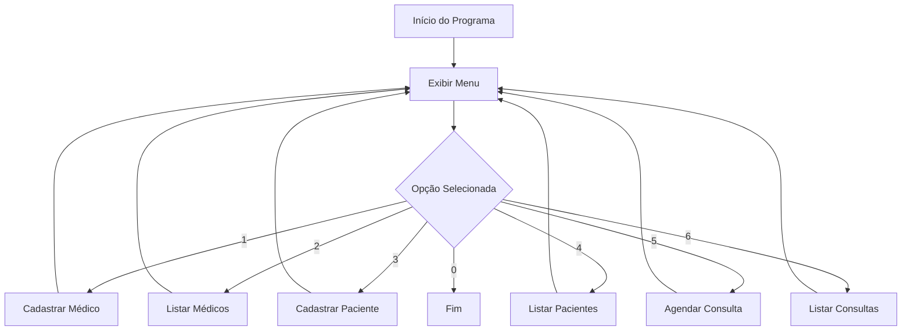

# 🏥 Clínica Consultas — Sistema de Agendamento com Entity Framework


Aplicação desenvolvida em **C# com .NET e Entity Framework**, simulando um sistema de **agendamento de consultas médicas**.  
Permite **cadastrar médicos, pacientes e consultas**, além de listar todos os registros armazenados em um **banco de dados SQL Server**.

---

## 🚀 Tecnologias Utilizadas

| Tecnologia | Descrição |
|-------------|------------|
| **C#** | Linguagem principal do projeto |
| **.NET 9** | Framework utilizado para execução |
| **Entity Framework Core** | ORM para comunicação com o banco de dados |
| **SQL Server** | Banco de dados relacional utilizado |
| **LINQ** | Para consultas e manipulação de dados |


---

## 🗂️ Relacionamento entre Entidades



---

## ⚙️ Funcionalidades

- ✅ Cadastrar Médicos
- ✅ Listar Médicos
- ✅ Cadastrar Pacientes
- ✅ Listar Pacientes
- ✅ Agendar Consultas
- ✅ Listar Consultas Agendadas

---


## 🧩 Execução do Programa

```
dotnet run
```

### 📋 Menu no terminal:

```css
Menu:
1 - Cadastrar Médico
2 - Listar Médicos
3 - Cadastrar Paciente
4 - Listar Pacientes
5 - Agendar Consulta
6 - Listar Consultas
0 - Sair
```

### 📌 Exemplo de Cadastro:

```vbnet
Nome do médico: Dr. Ricardo Almeida
Especialidade: Cardiologia
CRM: 123456-PE
Médico cadastrado!
```

### 📅 Exemplo de Agendamento:

```java
Nome do médico: Dr. Ricardo Almeida
Especialidade: Cardiologia
CRM: 123456-PE
Médico cadastrado!
```


### 📝 Listagem

```yaml
Id: 1 - Data: 23/10/2025 09:30 - Médico: Dr. Ricardo Almeida - Paciente: Ana Clara Barbosa - Descrição: Consulta agendada
```

---

## 🧮 Fluxo do Sistema


---

## 📊 Exemplo de Dados

| Id | Médico               | Paciente              | Data da Consulta | Descrição         |
| -- | -------------------- | --------------------- | ---------------- | ----------------- |
| 1  | Dr. Ricardo Almeida  | Ana Clara Barbosa     | 23/10/2025 09:30 | Consulta agendada |
| 2  | Dra. Juliana Martins | Lucas Henrique Alves  | 23/10/2025 14:00 | Consulta agendada |
| 3  | Dr. Felipe Souza     | Mariana Costa Pereira | 24/10/2025 08:30 | Consulta agendada |

---

## 💡 Melhorias Futuras

- Criar versão Web API com ASP.NET Core
- Implementar autenticação de usuários
- Adicionar sistema de cancelamento e edição de consultas
- Criar logs de ações e histórico de consultas

---

## 👩‍💻 Desenvolvido por

**Stephanie Tavares dos Santos**

🔗 [LinkedIn](https://www.linkedin.com/in/stephanie-t-santos/)  

💻 [GitHub](https://github.com/stephtavzz)  
